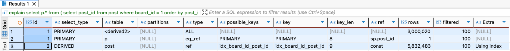
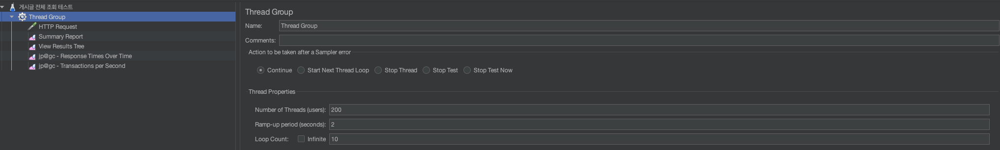
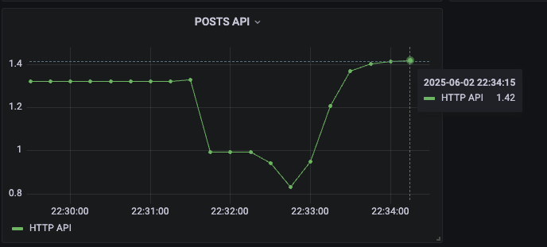
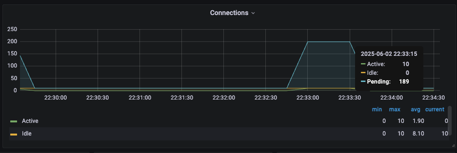
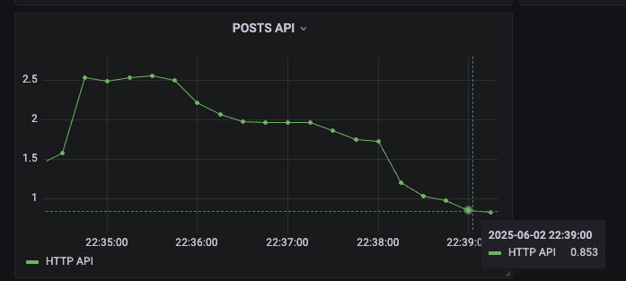
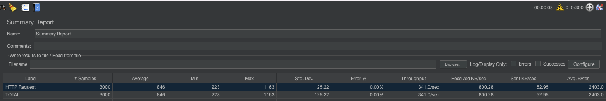

# 대규모 시스템 쿼리 튜닝 및 성능 개선

대규모 시스템에서 각 기능이 독립적인 애플리케이션으로 구현된다고 가정한다. 즉, 각 기능이 모듈로 분리 되어 있다.

여기서는 게시판(board)과 게시글(post) 기능을 개발할 때, 게시글 기능을 위주로 시스템의 성능 개선을 위한 단계를 진행할 것이다.

<br/>

## DB 테이블 구조

```sql
create table board (
	board_id BIGINT PRIMARY KEY AUTO_INCREMENT,
	name VARCHAR(50) NOT NULL,
	created_at TIMESTAMP,
	modified_at TIMESTAMP
);

create table post (
	post_id BIGINT PRIMARY KEY AUTO_INCREMENT,
	title VARCHAR(50) NOT NULL,
	content VARCHAR(1000),
	views BIGINT,
	post_type VARCHAR(20),
	board_id BIGINT,
	created_at TIMESTAMP,
	modified_at TIMESTAMP,
	CONSTRAINT fk_board_id FOREIGN KEY (board_id) REFERENCES board(board_id)
);
```

각 기능이 모듈로 분리돼 있기 때문에 post 테이블의 board_id는 논리적 외래 키로 연결한다. **게시글 테이블에는 레코드가 1200만 건 정도 저장되어 있다.**

<br/>

## 애플리케이션 설계

애플리케이션을 설계할 떄 중점은 쿼리 튜닝 및 성능 개선에 둘 것이기 때문에 엔티티 객체에 대한 설명보다는 쿼리 튜닝 및 성능 개선을 어떻게 진행하는지를 중점으로 볼 것이다.   

게시판은 보통 게시글 CUD(생성, 삭제, 수정) 작업보다는 조회로 인한 성능 저하가 크다.  
페이징 처리를 하는 게시판의 게시물 조회 로직을 중심으로 쿼리 튜닝 및 애플리케이션의 개선을 통해서 이 부분을 개선시킬 것이다.

우선 post 엔티티를 생성한다.

```java
@NoArgsConstructor(access = AccessLevel.PROTECTED)
@Getter
@Entity
public class Post extends BaseEntity {

    @Id
    @GeneratedValue(strategy = GenerationType.IDENTITY)
    @Column(name = "post_id")
    private Long id;

    private String title;

    private String content;

    @Enumerated(EnumType.STRING)
    private PostType postType;

    private long views;

    private Long boardId;
    
    // ...
}
```

### 조회 쿼리 설계

```sql
select * from post where board_id = 1L order by post_id desc limit 20 offset 0
-- 결과
-- 20 row(s) fetched 0.12s

select * from post where board_id = 1L order by post_id desc limit 20 offset 3000000
-- 결과
-- 20 row(s) fetched 2.61s
```

위 쿼리는 페이징을 처리하는 게시글 조회 쿼리이다. 쿼리에서 게시글은 순차적으로 저장됐기 때문에 생성일인 `created_at`이 아닌 `post_id`를 역순으로 정렬해도 생성일 기준으로 게시글을 출력하게 된다.  

여기서 우리는 board_id가 논리적 외래키로 인덱스가 지정되어있지 않음을 생각해야 한다. 그리고 페이징 쿼리에서 offset 을 3000000 처럼 증가시키면 조회 시간이 2초 이상으로 걸리게 된다.  

우선 인덱스를 설정해준다. 인덱스는 `board_id`와 `post_id desc`로 설정해준다.  

```sql
create index idx_board_id_post_id on post (board_id, post_id desc);
```

<br/> 

다시 한번 쿼리를 실행해본다. 

```sql
select * from post where board_id = 1 order by post_id desc limit 20 offset 3000000;

-- 결과
-- 20 row(s) fetched 13.42s
```

쿼리를 실행하면 거의 12초로 5배 이상의 시간이 걸리게 된다. `explain` 명령어로 실행 계획을 확인하면 인덱스는 적용되고 있다.  

이유를 확인하면 MySQL B+Tree 구조를 사용하며 PK로 지정한 컬럼이 클러스터링 인덱스로 오름차순으로 정렬되어 있고, 이외의 생성된 인덱스는 세컨더리 인덱스가 된다.  
MySQL에서 쿼리를 조회할 때 세컨더리 인덱스의 리프 노드는 데이터 값을 갖는 것이 아닌 클러스터링 인덱스의 포인터인 PK를 갖게 되며, 세컨더리 인덱스에서 찾은 PK 포인터 값으로 클러스터링 인덱스를 다시 조회해서 값을 찾아낸다.  
지금 쿼리는 세컨더리 인덱스에서 offset 1번을 찾은 뒤 pk값(포인터)으로 클러스터링 인덱스의 offset 1번을 찾고, 이 방식으로 순차적으로 찾아가는 과정을 offset 3000000번 까지 반복하므로 시간이 배로 소비되는 것이다.  

<br/>

이 비효율적인 작업을 해결하기 위해서 세컨더리 인덱스에서 pk인 `post_id`를 limit 만큼 찾아서 게시글을 조회하면 속도를 개선시킬 수 있다.  
여기서 커버링 인덱스를 통해 우리가 생성한 세컨더리 인덱스만을 사용해서 `post_id`를 찾아준 뒤, 찾은 `post_id`로 게시글을 조회해서 쿼리를 튜닝할 것이다.    
커버링 인덱스란 인덱스만으로 필요한 모든 정보를 얻을 수 있도록 구성된 인덱스로, 쿼리에서 사용되는 모든 컬럼이 포함된 인덱스를 말한다.   

```sql
select p.* from (
	select post_id from post where board_id = 1 order by post_id desc limit 20 offset 3000000
) sp left join post p on sp.post_id = p.post_id;

-- 결과
-- 20 row(s) fetched 0.637s
```

쿼리를 수행했을 때, 인덱스도 제대로 사용됐고, 조회 시간도 1초 안으로 개선됏음을 확인할 수 있다.  

  

<br/>

결론적으로 확인해야 할 것은 1페이지인 offset이 0일 때는 쿼리가 빠르게 실행되지만, offset이 증가하면서 쿼리 실행 시간이 길어지게 된다.  

이를 해결하기 위해서는 몇 가지 방법을 생각할 수 있으며, 직접 구현하지는 않을 것이다.
- 1만 페이지 이상을 조회하는 경우를 차단
- 테이블의 파티션을 `board_id` 혹은 년도로 분리
- Master/Slave 아키텍처 적용
  - 마스터 슬레이브 아키텍처란 쓰기 작업을 처리하는 주 데이터베이스인 마스터 데이터베이스와 조회를 담당하는 슬레이브 데이터베이스를 나누어 처리하는 아키텍처이다. 이 전략은 데이터베이스의 복제 및 분산 처리를 통해 성능을 개선한다.
- 샤드 분리
  - 샤딩은 대규모 서비스에서 데이터베이스를 수평적으로 분할해 성능을 향상시키는 전략이다.

<br/>

#### count 쿼리 설계

게시글(post) 테이블에는 1200만 건의 레코드를 저장했는데 테스트를 위해서 `board_id`가 1인 레코드들을 저장했다. 

```sql
select count(*) from post where board_id = 1;
```

쿼리를 실행해보면 해당 게시판의 전체 게시글을 조회하는데 2초 이상의 시간이 소요된다.   
결국 게시판의 전체 게시글을 조회하기 위해서는 `board_id`가 1인 게시판의 게시글인 1200만 건의 데이터를 스캔해야 하므로, 게시판의 게시글이 증가할 때마다 count 쿼리 실행 시간은 길어진다.  

게시판마다 게시글이 쌓이는 것은 증가될 것이고 카운트 쿼리를 사용할 때 테이블의 레코드를 스캔하는 양이 증가함에 따라 쿼리 실행 시간은 길어질 수 밖에 없다.  
이 문제를 해결하기 위해서 게시판 게시글의 수를 관리할 테이블을 생성하고 게시글(post) 테이블을 조회해서 게시판의 전체 게시글의 카운트를 확인하는 것이 아니라 전용 테이블을 사용해서 조회하는 방식으로 개선할 것이다.

게시판의 게시글 수(board_post_count) 테이블을 생성한다.

```sql
CREATE TABLE board_post_count (
    board_id BIGINT PRIMARY KEY,
    post_count BIGINT
)
```

이제 게시글을 생성할 때 테이블의 `post_count`를 증가시키고, 게시글을 제거할 때 `post_count`를 감소시키면 된다. 그리고 게시글의 전체 수는 이 테이블을 조회하면 빠르게 얻을 수 있다.  

이제 조회 쿼리를 인덱스 사용 및 카운트 전용 테이블 생성으로 개선했다. 이제 JMeter로 성능 테스트를 진행하면서 애플리케이션을 개선 시켜볼 것이다.   

<br/>

## 부하 테스트

부하 테스트는 Grafana k6, Apache JMeter 등을 사용할 수 있는데 여기서는 JMeter를 사용해 GUI로 부하 테스트를 진행한다.  
부하 테스트 시 애플리케이션 모니터링은 프로메테우스, 그라파나를 사용할 것이다. (이 부분의 설정 방법은 생략한다.)

<br/>

### JMeter 설정

다음은 JMeter Thread Group의 설정이다. 스레드 수는 200. ramp-up은 2, 총 10번 반복한다.

  

<br/>

테스트에서는 어느정도 비즈니스로직을 처리하는데 시간이 걸리는 것을 테스트하기 위해서 페이지를 500000 페이지를 적용했다.    

이제 JMeter로 성능 테스트를 진행하면서 다음과 같은 결과가 나왔다.

**평균 응답시간**  


**DB Connection**
  

<br/>

데이터를 확인하면 게시글을 조회하는데 최소 시간은 0.4s가 걸린 반면, 성능 테스트를 진행하며 250개의 스레드가 총 10번 반복해서 2500개의 샘플로 테스트가 진행되면서 결국 평균 응답시간은 10초 이상 걸리게 됐다.  

여기서 DBCP의 정보를 그라파나에서 확인했을 때 pending 상태가 190인 것을 볼 수 있는데, 이 부분을 이해하기 위해서 우선 스프링 부트의 톰캣과 기본으로 사용되는 DBCP인 HikariCP의 설정을 알아야 한다.

<br/>

### 스프링 부트의 Tomcat, HikariCP 설정 정보

스프링 부트 애플리케이션에서 톰캣의 설정 정보는 다음과 같다.
```yaml
server:
  tomcat:
    threads:
      max: 200 
      min-spare: 10 
    max-connections: 8192 
    accept-count: 100
spring:
  datasource:
    hikari:
      maximum-pool-size: 10 # (기본값: 10) 최대 커넥션 풀 크기
      minimum-idle: 10 # (기본값: maximum-pool-size와 동일) 최소 유휴 커넥션 수
```

위의 설정은 모두 스프링 부트의 기본 값이다.

- `server.tomcat.threads.max`: 톰캣이 동시에 요청을 처리할 수 있는 최대 스레드 수
- `server.tomcat.threads.min-spare`: 톰캣이 유지하는 최소 유휴 스레드 수
- `server.tomcat.max-connections`: 톰캣이 동시에 처리할 수 있는 최대 연결 수
- `server.tomcat.accept-count`: 모든 스레드가 사용 중일 때 연결 요청을 대기시킬 큐의 최대 크기

결국 그라파나 대시보드의 패널을 보면 톰캣의 200개의 스레드가 모두 요청을 처리하는데, 200개의 스레드가 요청을 처리하기 위해서 DBCP의 커넥션을 획득해야 한다.  
하지만 HikariCP의 기본 커넥션 설정의 쵀대 커넥션 수는 10개이므로 10개의 스레드만 커넥션을 획득해서 DB에 게시글을 조회해서 처리하게되어 응답시간의 지연이 생기게 된 것이다.  

<br/>

그렇다면 톰캣 스레드 설정과 DBCP의 설정은 어떻게 하면 될 것인가?  

톰캣의 스레드는 결국 ThreadPoolExecutor로 구현되어 JVM의 스레드를 사용한다. JVM은 OS에게 요청을 통해서 스레드를 생성하게 되고, 이는 CPU Bound 작업이 된다.  
스프링 부트의 톰캣 스레드의 기본 설정은 최대 200에 유휴 스레드가 10인데 클라이언트의 동시 요청이 증가했을 때, 유휴 스레드를 유지하다가 최대 스레드 수 만큼 스레드를 생성하는 것도 CPU의 부하가 가해진다. 그렇다고 유휴 스레드를 너무 크게 설정하면 요청이 적을 때 사용되는 리소스가 낭비된다.      
결론적으로 이 값은 정해져 있는 것이 아닌, 배포되는 서버의 스펙을 확인하고 성능 테스트를 진행했을 때 CPU 부하를 확인하면서 유휴 스레드와 최대 스레드를 설정하는 것이 좋다.  

이제 HikariCP의 커넥션 수를 설정한다. 프로젝트의 DB 서버는 MySQL을 사용했으며 DB 서버에 설정된 `MAX_CONNECTION`값은 200으로 설정되어있다.  
새로운 커넥션을 생성하고 연결하는 것은 CPU나 메모리의 리소스를 많이 사용하는 것이 아닌, DB 서버와 네트워크 연결을 수립하는 과정이다. JDBC 드라이버는 TCP 프로토콜을 통해 DB 서버로 연결 요청을 보내고, DB 서버는 연결을 수락한 수 세션을 생성한다.  
이런 네트워크 작업은 CPU 연산보다는 네트워크 IO 대기 시간이 크기 때문에 IO Bound 작업이다.  
그러면 DBCP의 커넥션 수도 톰캣 스레드 수와 동일하게 하는 것이 좋은 것인지 생각을 해봤는데, 애플리케이션으로 오는 모든 요청이 DB 트랜잭션을 통한 처리를 하지는 않을 것다. 그렇게되면 사용되지 않는 커넥션이 존재할 것이고, 이런 사항들을 고려해서 설정하는 것이 좋다.  
여기서는 DB 서버의 `MAX_CONNCETION` 값과 조회 쿼리의 실행 시간을 고려해서 HikariCP의 최대 커넥션과 유휴 커넥션을 40으로 설정했다. 유휴 커넥션은 HikariCP의 깃허브 README를 보면 성능을 위해 최대 커넥션과 같은 크기를 권장한다.

> 🔢minimumIdle  
> This property controls the minimum number of idle connections that HikariCP tries to maintain in the pool. If the idle connections dip below this value and total connections in the pool are less than maximumPoolSize, HikariCP will make a best effort to add additional connections quickly and efficiently. However, for maximum performance and responsiveness to spike demands, we recommend not setting this value and instead allowing HikariCP to act as a fixed size connection pool. Default: same as maximumPoolSize  

<br/>

이제 수정을 완료하고 애플리케이션을 다시 테스트해본다.

  



요청의  평균 응답 처리시간을 대시보드로 확인했을 때 800ms 정도로 감소했고, 최대 전송 속도도 1초 가까이로 감소한 것을 확인할 수 있다.  

<br/>

## 정리

결론적으로 DB 서버 및 애플리케이션 서버의 사용가능한 리소스에 맞는 설정을 찾는 것이 중요한 것 같다.   

애플리케이션의 성능을 확인할 때 우선 비즈니스 로직이 잘못된 부분이 있다면 개선하고, 작성된 쿼리를 튜닝해서 처리 시간을 감소시키는 것이 중요하다. 
다음으로 성능 테스트를 진행하며 서버 스펙에 맞도록 톰캣 스레드와 커넥션을 설정하면 되고, 서버 리소스를 온전히 사용하면서도 요청을 처리할 수 없다면 서버 Scale Out을 고려하면 될 것 같다.

<br/>
<br/>