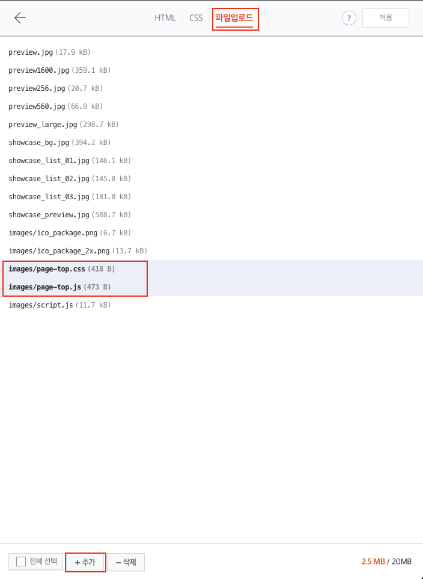
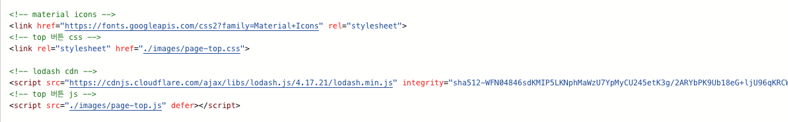
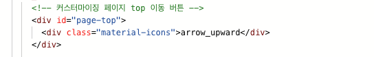

# 티스토리 페이지 상단(TOP) 스크롤 이동 버튼 생성 

티스토리의 `Book Club` 블로그 테마를 사용하며 하단에 있는 상단으로 스크롤을 이동하는 버튼의 불편함을 방지하기 위해서 만들었다.  

`page-top.css`, `page-top.js` 파일을 자신의 로컬 경로에 저장한다.  

티스토리 로그인하고 블로그 관리 -> 스킨 편집 -> HTML 편집으로 이동한다.

<br/>

### css, js 파일 적용

파일업로드를 선택하고 위에서 저장한 `page-top.css`, `page-top.js` 파일을 등록해준다.



<br/>

### html 수정

파일을 업로드 한 뒤 HTML을 선택하고 `<head>` 태그에 버튼 아이콘을 위한 Google Material Icons와 스로틀링 문제 해결을 위한 lodash 라이브러리를 설정해준다. `<meta>` 태그 아래에 설정해주면 된다. 


```html
<head>
  <!-- material icons -->
  <link href="https://fonts.googleapis.com/css2?family=Material+Icons" rel="stylesheet">
  <!-- top 버튼 css -->
  <link rel="stylesheet" href="./images/page-top.css">

  <!-- lodash cdn -->
  <script src="https://cdnjs.cloudflare.com/ajax/libs/lodash.js/4.17.21/lodash.min.js" integrity="sha512-WFN04846sdKMIP5LKNphMaWzU7YpMyCU245etK3g/2ARYbPK9Ub18eG+ljU96qKRCWh+quCY7yefSmlkQw1ANQ==" crossorigin="anonymous" referrerpolicy="no-referrer"></script>
  <!-- top 버튼 js -->
  <script src="./images/page-top.js" defer></script>
</head>
```
<br/>



<br/>

다음으로 `<body>` 태그에 페이지 버튼을 생성하기 위한 div 태그를 등록해준다. 태그의 위치는 자신이 원하는 위치에 두어도 상관없지만 수정된 곳을 확인하는데 수월한 `<body>` 태그의 상단이나 하단에 두는 것이 좋다.

```html
<body>
  	<!-- 커스터마이징 페이지 top 이동 버튼 -->
    <div id="page-top">
      <div class="material-icons">arrow_upward</div>
    </div>
</body>
```
<br/>

  

<br/>
<br/>

이제 변경 내용을 저장하고 블로그로 이동하면 스크롤이 일정 높이 이상 내려가면 스크롤 버튼이 생성되는 것을 확인할 수 있다.

<br/>

### 기능 정리

페이지를 읽는 중 스크롤을 상단으로 이동시킬 때 수동으로 이동시켜야 하는 불편함을 해결하려고 만들었다.

필자가 사용한 블로그 테마는 `Book Club`이지만 스크롤 버튼은 어느 테마에서도 적용 가능하다.

자바스크립트의 Scroll 이벤트는 마우스 스크롤을 할 때마다 동작하는데 이는 짧은 시간동안 수백 수천번의 스크롤 이벤트를 발생시키는데, 이를 방지하기 위해서 lodash를 사용해서 쓰로틀링을 적용했다.

페이지의 스크롤 Y축이 일정 범위로 내려가게되면 우측 하단에 스크롤 버튼이 생성되고, 버튼을 누르면 포스팅 글의 상단으로 스크롤이 이동하게 된다.

상단 스크롤 이동 버튼은 우측 하단의 위치에 고정된다.

<br/>